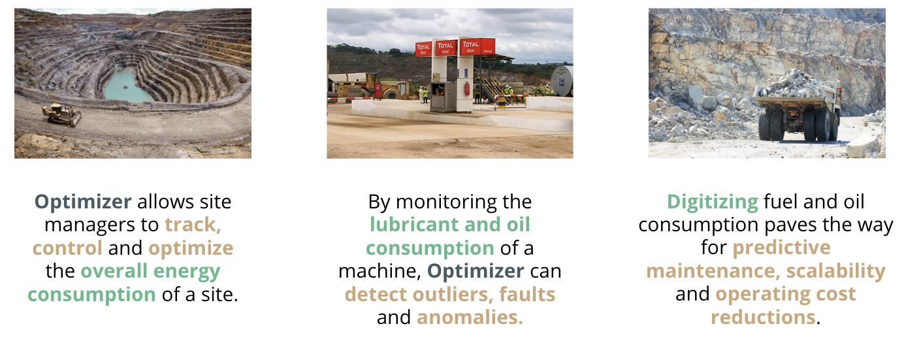
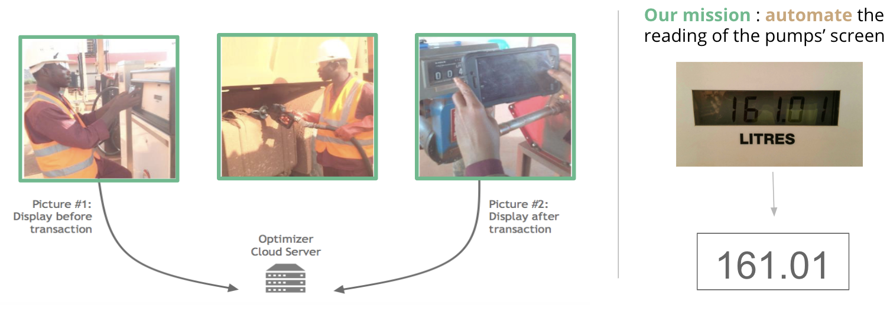
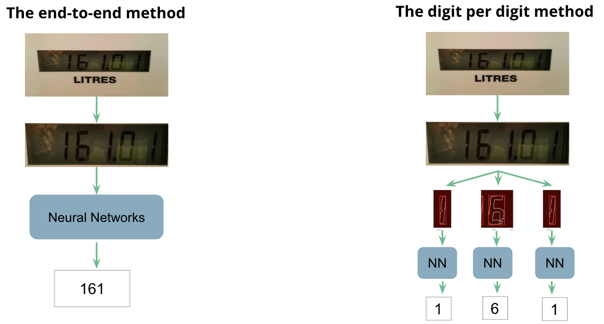
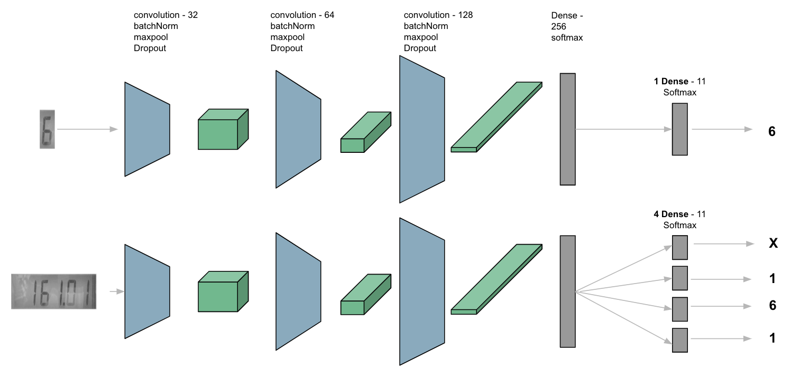
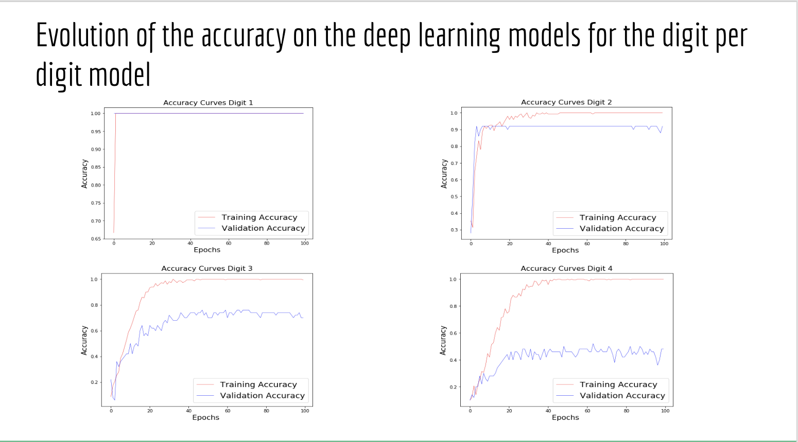

# Optimizer
## A seven-segment digits OCR

Optimizer is a seven-segment digits OCR class project carried out by [Alex](https://github.com/alexmomeni), [Priscille](https://github.com/priscilleb), [Charlotte](https://github.com/charlottecaucheteux/) and [Sacha](https://github.com/SachaIZADI/).

## Objective

The aim of the project is to digitize the monitoring of mines activities. We focused on the gas and lubricant consumption of vehicles within the mines. The idea is to build computer vision model that would enable operators to take a picture of the gas pump with their smartphones, and automatically log the value of the gas transaction. We were given ~850 pictures (of varying quality) of the gas pump with their associated values.

## Approaches

We tried 2 different approaches:
1. The "digit-per-digit" approach
    1. Image processing: identify the screen, crop the picture, grayscale, thresholding, localize digits and crop them.
    2. Learning phase: learn a "MNIST" model that predicts each digit individually.
    3. Inference phase: pass each cropped digit to the "MNIST" model, and append the results.

2. The "end-to-end" approach
    1. Image processing: identify the screen, crop the picture, grayscale and thresholding.
    2. Learning phase: learn a model that predicts all digits at once. We based our model on the ["Multi-digit Number Recognition from Street View Imagery using Deep Convolutional Neural Networks"](https://static.googleusercontent.com/media/research.google.com/fr//pubs/archive/42241.pdf) paper by Goodfellow & al. The idea is to build a ConvNet that simultaneously learns (i) the digits and (ii) where to look for them.

## Results
 

## How to reproduce our work and run our models

TBC...

#1 Preprocessing
python frame_extractor.py

#2 Preprocessing
python digits_cut.py

#3 Model
python main.py
